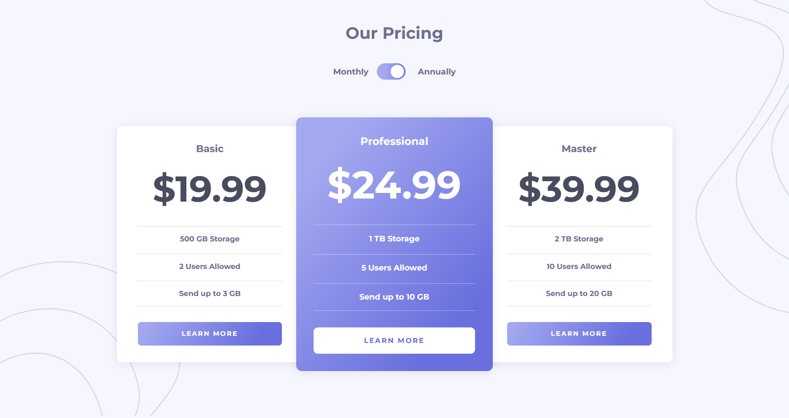

# Frontend Mentor - Pricing component with toggle solution

This is a solution to the [Pricing component with toggle challenge on Frontend Mentor](https://www.frontendmentor.io/challenges/pricing-component-with-toggle-8vPwRMIC). Frontend Mentor challenges help you improve your coding skills by building realistic projects. 

## Table of contents

- [Overview](#overview)
  - [The challenge](#the-challenge)
  - [Screenshot](#screenshot)
  - [Links](#links)
- [My process](#my-process)
  - [Built with](#built-with)
  - [What I learned](#what-i-learned)
  - [Useful resources](#useful-resources)
- [Author](#author)

## Overview

### The challenge

Users should be able to:

- View the optimal layout for the component depending on their device's screen size
- Control the toggle with both their mouse/trackpad and their keyboard

### Screenshot

### Links

[Live site URL](https://pricing-component-w-toggle-kas.netlify.app/)

## My process

### Built with

- Semantic HTML5 markup
- CSS custom properties
- Flexbox
- CSS Grid
- Mobile-first workflow

### What I learned

I used this challenge to learn about toggle switches and some accessibility concerns that come with them. As it turned out when doing research, there's a lot more to this topic than I originally thought. Sara Soueidan's [article](https://www.sarasoueidan.com/blog/toggle-switch-design/) is a great read, and it helped me understand what needs to be taken into consideration when designing toggle switches and what semantic elements we may choose depending on the context. Then I followed one of her recommendations and checked out a [codepen](https://codepen.io/scottohara/pen/zLZwNv) from Scott O'Hara to see how this gets implemented. I ended up using his code and tweaking it a bit for my project. The markup is very straightforward, most of the actual toggle is being implemented by some pseudo-elements.

### Useful resources

- [Scott O'Hara's toggle switch](https://codepen.io/scottohara/pen/zLZwNv) 
- [Article from Sara Soueidan](https://www.sarasoueidan.com/blog/toggle-switch-design/) 

## Author

- Frontend Mentor - [@FluffyKas](https://www.frontendmentor.io/profile/FluffyKas)

